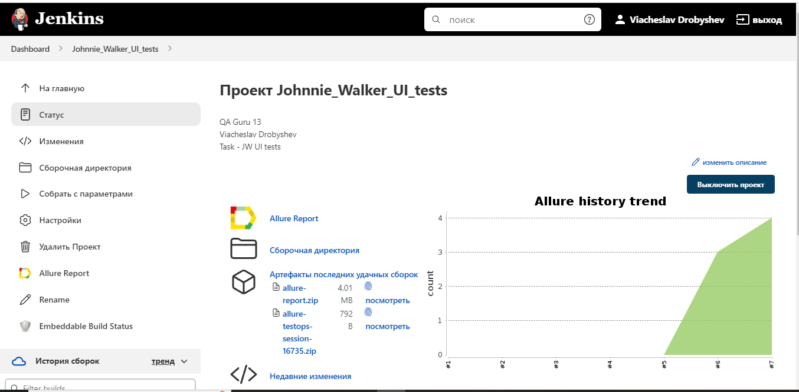
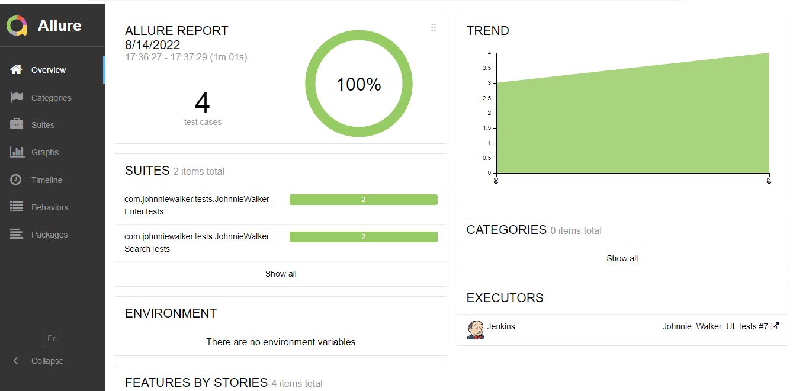
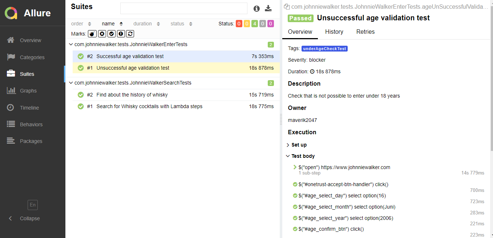
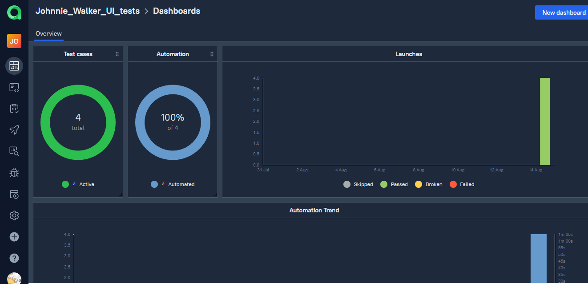
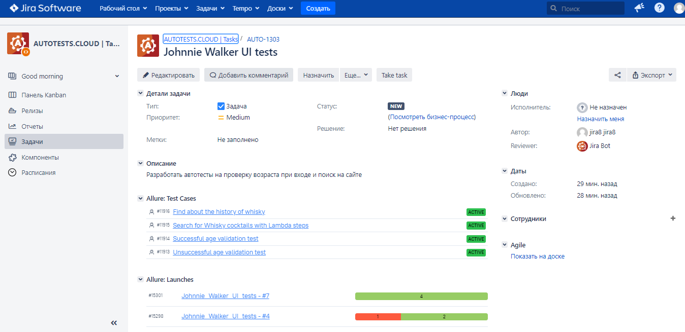
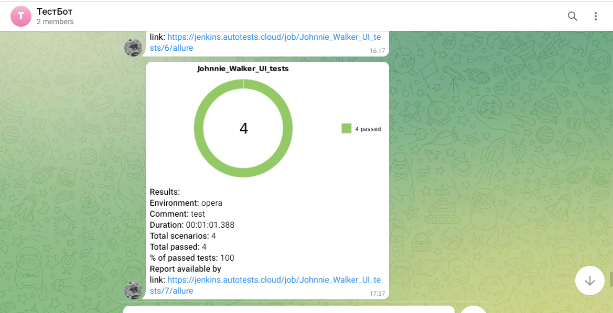

# Демо проект по автоматизации Johnnie Walker


## : Содержание:

> ➠ [Технологический стек](#classical_building-технологический-стек)
>
> ➠ [Покрытый функционал](#earth_africa-покрытый-функционал)
>
> ➠ [Сборка в Jenkins](#earth_africa-Jenkins-job)
>
> ➠ [Запуск из терминала](#earth_africa-Запуск-тестов-из-терминала)
>
> ➠ [Примеры использования](#earth_africa-Allure-отчет)
>
> ➠ [Allure отчет](#earth_africa-Allure-отчет)
> 
> ➠ [Интеграция с Jira](#earth_africa-Allure-отчет)
>
> ➠ [Отчет в Telegram](#earth_africa-Уведомление-в-Telegram-при-помощи-бота)
>
> ➠ [Видео примеры прохождения тестов](#earth_africa-Примеры-видео-о-прохождении-тестов)

  
## 🧰: Технологии и инструменты

<p align="center">
<a href="https://www.jetbrains.com/idea/"></a>
<a href="https://www.java.com/"></a>
<a href="https://github.com/"></a>
<a href="https://junit.org/junit5/"></a>
<a href="https://gradle.org/"></a>
<a href="https://selenide.org/"></a>
<a href="https://aerokube.com/selenoid/"></a>
<a href="https://github.com/allure-framework/allure2"></a>
<a href="https://www.jenkins.io/"></a>
<a href="https://qameta.io/"></a>  
<a href="https://www.atlassian.com/ru/software/jira/"></a>  
</p>
В данном проекте автотесты написаны на <code>Java</code> с использованием <code>Selenide</code> для UI-тестов.

Реализован паттерн PageObject и Lambda Steps
>
> <code>Selenoid</code> выполняет запуск браузеров в контейнерах <code>Docker</code>.
>
> <code>Allure Report/Allure TestOps</code> формирут отчеты о запуске тестов.
>
> Для автоматизированной сборки проекта используется <code>Gradle</code>.
>
> В качестве библиотеки для модульного тестирования используется <code>JUnit 5</code>.
>
> <code>Jenkins</code> выполняет запуск тестов.
> После завершения прогона отправляются уведомления с помощью бота в <code>Telegram</code>.

## Покрытый функционал

> Разработаны автотесты на <code>UI</code>.
### UI

- [x] Тестирование входа на сайт до 18 лет
- [x] Тестирование входа на сайт после 18 лет
- [x] Тестирование поиска коктейлей
- [x] Тестирование поиска истории виски
## </a> Jenkins <a target="_blank" href="https://jenkins.autotests.cloud/job/Johnnie_Walker_UI_tests/"> job </a>
<p align="center">
<a href="https://jenkins.autotests.cloud/job/Johnnie_Walker_UI_tests/"></a>
</p>

### Удаленный запуск тестов на Jenkins

```
clean
test
-Duser=${USER}
-Dpassword=${PASSWORD}
-DremoteBrowser=${REMOTE_DRIVER_URL}
-Dbrowser=${BROWSER}
-Dsize=${BROUSERSIZE}
-Dversion=${VERSION}
```
##  Запуск тестов из терминала
Локальный запуск:
```
gradle clean test
```

# Примеры использования

### Для запуска удаленных тестов необходимо заполнить remote.properties или передать значение:

* browser (default chrome)
* browserVersion (default 89.0)
* browserSize (default 1920x1080)
* browserMobileView (mobile device name, for example iPhone X)
* remoteDriverUrl (url address from selenoid or grid)
* videoStorage (url address where you should get video)
* threads (number of threads)


Запускайте тесты с заполненным remote.properties:
```bash
gradle clean test
```

Запускайте тесты с незаполненным remote.properties:
```bash
gradle clean -DremoteDriverUrl=https://%s:%s@selenoid.autotests.cloud/wd/hub/ -DvideoStorage=https://selenoid.autotests.cloud/video/ -Dthreads=1 test
```

Сгенерировать отчет:
```bash
allure serve build/allure-results
```
## </a> Отчет в <a target="_blank" href="https://jenkins.autotests.cloud/job/Johnnie_Walker_UI_tests/7/allure/">Allure report</a>

###  Основной отчет
<p align="center">

</p>


### Тесты 
<p align="center">

</p>

## </a> Отчет в <a target="_blank" href="https://allure.autotests.cloud/launch/15301">Allure TestOps</a>
<p align="center">

</p>
<p align="center">

</p>

## </a> Интеграция с <a target="_blank" href="https://jira.autotests.cloud/browse/AUTO-1303">Jira</a>
<p align="center">

</p>

## </a> Уведомление в Telegram при помощи бота
> После завершения сборки специальный бот, созданный в <code>Telegram</code>, автоматически обрабатывает и отправляет сообщение с отчетом о прогоне.

<p align="center">

</p>

## Примеры запуска тестов в Selenoid
### </a> Видео <a target="_blank" href="https://selenoid.autotests.cloud/video/ef6f0961cd61bebe69b39d6591b8a072.mp4">прохождения тестов </a>
<p align="center">

</p>

